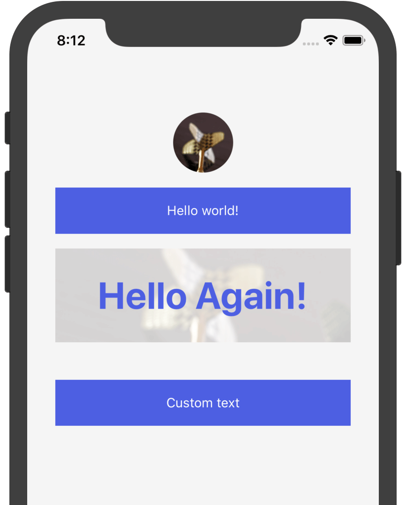

# ACSS React Native

Quick way to write style in react native.

Idea from Atomic CSS Design system.

```
$ npm install --save  @y-fe/acss-react-native
```

## How to use?

```
import React from 'react';
import {Text as RnText} from 'react-native';
import styled from "styled-components";
import {View, Text, Image, ImageBackground, Acss} from '@y-fe/acss-react-native';
import mImg1 from '../assets/pics/10.jpg';
import mImg2 from '../assets/pics/11.jpg';

const CusText = styled(RnText)`
  background-color:blue;
  color:#ffffff;
  text-align: center;
  padding-top: 8px;
  padding-bottom: 8px;
  ${props => Acss(props)}  
`;
export default class App extends React.Component {
    static navigationOptions = {
        title: 'Example1',
    };
    render() {
        return (
            <View bgc="#00ffff" p="30">
                <View mb="16" aic>
                    <Image w="64" h="64" source={mImg1}/>
                </View>
                <Text c="#00FFFF" p="16" bgc="red" tac mb="16">Hello world!</Text>
                <CusText mb="16">Custom text</CusText>
                <ImageBackground source={mImg2}>
                    <View p="16" bgc="rgba(0,0,0,.5)">
                        <Text fs="40" lh="100" tac fwb c="#FFFF00">Hello Again!</Text>
                    </View>
                </ImageBackground>
            </View>
        );
    }
};
```




## Name rules

- Only Initials `aic && 'align-items: center;' }`;
- Direct digital connection `${props.fw700 && 'font-weight:700'}`;


## API

```JSX
const Acss = props => `
    ${props.ac && `align-content: ${props.ac};`};
    ${props.acs && `align-content: stretch;`};
    ${props.acc && `align-content: center;`};
    ${props.acfs && `align-content: flex-start;`};
    ${props.acfe && `align-content: flex-end;`};
    ${props.acsb && `align-content: space-between;`};
    ${props.acsa && `align-content: space-around;`};        
    ${props.ai && `align-items: ${props.ai};`};
    ${props.ais && `align-items: stretch;`};
    ${props.aib && `align-items: baseline;`};
    ${props.aic && `align-items: center;`};
    ${props.aifs && `align-items: flex-start;`};
    ${props.aife && `align-items: flex-end;`};    
    ${props.as && `align-self: ${props.as};`};
    ${props.asa && `align-self: auto;`};
    ${props.ass && `align-self: stretch;`};
    ${props.asb && `align-self: baseline;`};
    ${props.asc && `align-self: center;`};
    ${props.asfs && `align-self: flex-start;`};
    ${props.asfe && `align-self: flex-end;`};
    ${props.bc && `background-color:${props.bc};`};
    ${props.br && `border-radius:${props.br};`};
    ${props.bw && `border-width:${props.bw};`};
    ${props.bs && `border-style:${props.bs};`};
    ${props.btw && `border-top-width:${props.btw};`};
    ${props.btc && `border-top-color:${props.btc};`};
    ${props.brw && `border-right-width:${props.brw};`};
    ${props.brc && `border-right-color:${props.brc};`};
    ${props.bbw && `border-bottom-width:${props.bbw};`};
    ${props.bbc && `border-bottom-color:${props.bbc};`};
    ${props.blw && `border-left-width:${props.blw};`};
    ${props.blc && `border-left-color:${props.blc};`};
    ${props.btrr && `border-top-right-radius:${props.btrr};`};
    ${props.btlr && `border-top-left-radius:${props.btlr};`};
    ${props.bbrr && `border-bottom-right-radius:${props.bbrr};`};
    ${props.bblr && `border-bottom-left-radius:${props.bblr};`};
    ${props.b && `bottom:${props.b};`};
    ${props.b0 && `bottom:${props.b0};`};
    ${props.c && `color: ${props.c};`};
    ${props.dn && `display: none;`};
    ${props.f && `flex:${props.f};`};
    ${props.f1 && `flex:1;`};
    ${props.fdr && `flex-direction: row;`};
    ${props.fdrr && `flex-direction: row-reverse;`};
    ${props.fdc && `flex-direction: column;`};    
    ${props.fdcr && `flex-direction: column-reverse;`};
    ${props.fwn && `flex-wrap: nowrap;`};    
    ${props.fwb && `font-weight:bold;`};    
    ${props.fw100 && `font-weight:100;`};
    ${props.fw100 && `font-weight:200;`};
    ${props.fw300 && `font-weight:300;`};
    ${props.fw400 && `font-weight:400;`};
    ${props.fw500 && `font-weight:500;`};
    ${props.fw600 && `font-weight:600;`};
    ${props.fw700 && `font-weight:700;`};
    ${props.fw800 && `font-weight:800;`};
    ${props.fw900 && `font-weight:900;`};
    ${props.fs && `font-size: ${props.fs};`};
    ${props.ff && `font-family: ${props.ff};`};
    ${props.fsn && `font-style:normal;`};
    ${props.fsi && `font-style:italic;`};
    ${props.h && `height:${props.h};`}; 
    ${props.jcc && `justify-content: center;`};
    ${props.jcsb && `justify-content: space-between;`};
    ${props.jcfs && `justify-content: flex-start;`};
    ${props.jcfe && `justify-content: flex-end;`};
    ${props.jcsa && `justify-content: space-around;`};
    ${props.l && `left:${props.l};`};
    ${props.l0 && `left:${props.l0};`};
    ${props.lh && `line-height:${props.lh};`};
    ${props.m && `margin-top:${props.m}; margin-bottom:${props.m}; margin-left:${props.m}; margin-right:${props.m};`}
    ${props.mt && `margin-top:${props.mt};`};
    ${props.mr && `margin-right:${props.mr};`};
    ${props.mb && `margin-bottom:${props.mb};`};
    ${props.ml && `margin-left:${props.ml};`};
    ${props.o && `opacity:${props.o};`};  
    ${props.oh && `overflow:hidden`};    
    ${props.p && `padding-top:${props.p}; padding-left:${props.p}; padding-right:${props.p}; padding-bottom:${props.p};`};
    ${props.pa && `position:absolute;`};
    ${props.pr === true && `position:relative;`};
    ${props.pt && `padding-top:${props.pt};`};
    ${props.pr && props.pr > 0 && `padding-right:${props.pr};`};
    ${props.pb && `padding-bottom:${props.pb};`};
    ${props.pl && `padding-left:${props.pl};`};
    ${props.r && `right:${props.r};`};
    ${props.r0 && `right:${props.r0};`};
    ${props.t && `top:${props.t};`};
    ${props.t0 && `top:${props.t0};`};
    ${props.tac && `text-align:center;`};
    ${props.tar && `text-align:right;`};
    ${props.taa && `text-align:auto;`};
    ${props.tal && `text-align:left;`};
    ${props.taj && `text-align:justify;`};
    ${props.ttu && `text-transform: uppercase;`};
    ${props.ttc && `text-transform: capitalize;`}; 
    ${props.ttn && `text-transform: none;`};
    ${props.ttl && `text-transform: lowercase;`};     
    ${props.w && `width:${props.w};`};
    ${props.zi && `z-index:${props.zi};`};
`;
```

Pure, simple, natural. 

As you can see that is all the code we create blew. 

We just did a little but can help you a lot when create style in react native.

It is not perfect, but we can make it better together [issue](https://github.com/yued-fe/acss-react-native/issues).
